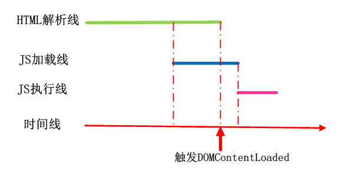
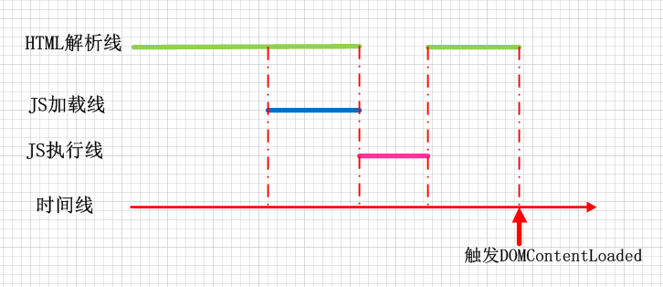

### 页面的生命周期包含的事件
1. DOMContentLoaded: 浏览器已完全加载HTML，并构建了DOM树
1. load: 加载完成了所有外部资源：图片，样式
1. beforeunload: 用户正在离开
1. unload: 用户几乎已经离开

### DOMContentLoaded和脚本、样式
1. DOMContentLoaded必须等待脚本执行结束，因为脚本可能会修改dom。不会阻塞DOMContentLoaded的情况是
    - 脚本设置async
    - document.createElement('script')动态生成并添加到网页的脚本
1. 外部样式表不会影响DOM，因此DOMContentLoaded不会等待它们。
    1. 但是脚本需要等样式表加载完成，因为脚本可能想要获取元素的坐标和其他与样式相关的属性， DOMContentLoaded等脚本执行的同时就也在等样式表的加载了
1. defer
    1. 具有defer特性的脚本并行下载不会阻塞页面，但是按序执行
    1. 执行是在DOM解析完毕之后，DOMContentLoaded事件之前
1. async
    1. 完全独立，异步加载不会阻塞浏览器，下载完就执行
    1. DOMContentLoaded和异步脚本不会彼此等待
        - DOMContentLoaded可能会发生在异步脚本之前（如果异步脚本在页面完成后才加载完成）
            
        - DOMContentLoaded也可能发生在异步脚本之后（如果异步脚本很短，或者是从HTTP缓存中加载的）
            
1. 动态脚本
    1. 当脚本被附加到文档 (*) 时，脚本就会立即开始加载，先加载完成的脚本先执行
    1. 显式地设置了script.async=false，则脚本将按照脚本在文档中的顺序执行

### 文档状态readyState
1. document.readyState 是文档的当前状态，可以在readystatechange事件中跟踪状态更改：
    1. loading —— 文档正在被加载。
    1. interactive —— 文档已被解析完成，与 DOMContentLoaded 几乎同时发生，但是在 DOMContentLoaded 之前发生。
    1. complete —— 文档和资源均已加载完成，与 window.onload 几乎同时发生，但是在 window.onload 之前发生
